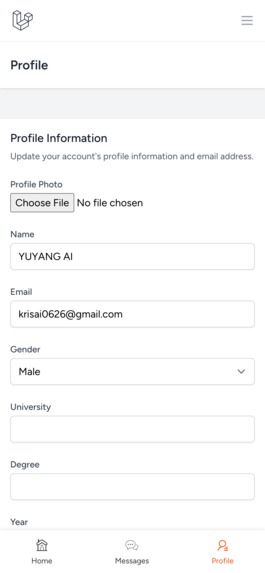
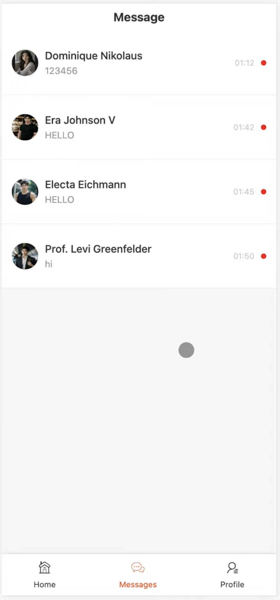

# TalentLink

TalentLink is a social app that connects students by displaying key profile details like school and skills, helping them find and collaborate with peers. This project was built using the Laravel PHP framework and includes a real-time chat feature with a focus on academic collaboration.


|  |  |  |
|:------------------------------------------------------:|:---------------------------------------------------------:|:------------------------------------------------------:|
| Home Page                                              | Profile View                                               | Chat List                                              |
### Demo Video

[Watch the demo video here](https://youtu.be/WQFrLbOPRTQ)

## Features
- Student Profiles: View profiles including school, major, skills, and internship experience.
- Matching Algorithm: Connect with peers based on shared interests and skills.
- Real-Time Chat: Engage in real-time communication through our native chat feature using long polling.
- Swipe Interface: Intuitive swipe functionality to browse and connect with potential collaborators.

## Built With
- Blade - Laravel's templating engine
- CSS - Styling for the application
- ES6 - Modern JavaScript syntax
- HTML5 - Structuring the web pages
- JavaScript - Enhancing interactivity
- Laravel - PHP framework for backend development
- MySQL - Database management
- PHP - Core language for the backend
- REST - API architecture for the backend

## Installation and Setup
To run the project locally, follow these steps:

1. Clone the repository:
```bash
git clone https://github.com/yourusername/talentlink.git
cd talentlink
```

2. Install PHP dependencies:
Make sure you have Composer installed. If not, you can install it from getcomposer.org.
```bash
composer install
```

3. Install Node.js dependencies:
Make sure you have Node.js and npm installed. If not, you can download them from nodejs.org.

```bash
npm install
composer install
```

4. Set up the environment file:
Copy the .env.example file to .env and update the environment variables to match your local setup:
```bash
cp .env.example .env
```

5. Generate the application key:
This is essential for Laravel to encrypt data properly.
```bash
php artisan key:generate
```

6. Run the database migrations:
Ensure your MySQL database is set up and the credentials are correct in your .env file.
```bash
php artisan migrate
```

7. Execute the seeders:
Seeders populate your database with initial data. Run the following command to execute the seeders:
```bash
php artisan db:seed --class=UserSeeder
```

8. Start the local development server:
You can now start the Laravel development server:
```bash
php artisan serve
```
The application will be accessible at http://localhost:8000.

## Usage
After setting up, you can register as a user, create a profile, and start browsing other profiles. The matching algorithm will suggest peers with complementary skills, and you can initiate a chat with them to discuss collaboration opportunities.

## Future Development
We plan to improve the matching algorithm by including additional data points, integrate project management tools, and collaborate with universities to incorporate TalentLink into their systems.

